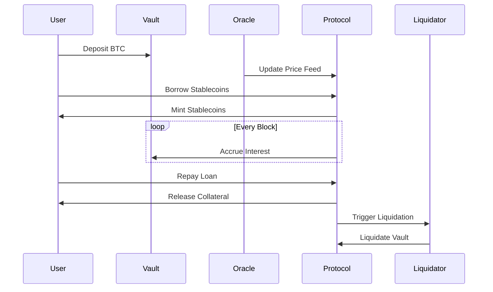

# BitBridge: Bitcoin-Backed Lending Protocol

## Overview

BitBridge is a decentralized lending protocol that enables Bitcoin holders to access USD-denominated liquidity while maintaining ownership of their BTC. Built on Stacks (a Bitcoin Layer 2 solution), it combines Bitcoin's security with DeFi flexibility through a non-custodial, over-collateralized lending system.

## Key Features

- BTC-Backed Stablecoin Loans
- Non-Custodial Collateral Management
- Decentralized Price Oracles
- Automated Liquidations
- Protocol-Controlled Reserves
- Governance Token Integration

## Architecture

### 1. Stacks Layer 2 Foundation

- **Bitcoin-Connected Smart Contracts**: Leverage Bitcoin's security through Stacks' Proof-Transfer consensus
- **Clarity Smart Contracts**: Predictable execution with formally verifiable code
- **Microblocks**: Fast transaction processing (3-5 second confirmation times)

### 2. Core Components

| Component              | Description                                                                 |
|------------------------|-----------------------------------------------------------------------------|
| **Collateral Vaults**  | Individual BTC deposit contracts with dynamic risk parameters               |
| **Price Oracle**       | Decentralized BTC/USD feed with multiple data sources                       |
| **Liquidation Engine** | Automated protection against undercollateralized positions                 |
| **Interest Model**     | Time-based compounding interest calculator                                  |
| **Governance Module**  | DAO-controlled protocol parameters with token voting                        |

### 3. System Flow



## Core Mechanisms

### 1. Collateralization

- Minimum Ratio: 150% (configurable)
- Liquidation Threshold: 125%
- Collateral Value = BTC Amount × Oracle Price

### 2. Loan Parameters

```math
MaxBorrow = (CollateralValue × 100) / MinimumCollateralRatio
Interest = Principal × (1 + Rate)^Time
```

### 3. Liquidation Process

1. Price update triggers health check
2. Undercollateralized vaults flagged
3. Liquidators repay debt for collateral + bonus
4. 10% penalty applied to liquidated positions

## Security Features

- **Time-Locked Governance**: Critical parameter changes require 48-hour delay
- **Circuit Breakers**: Protocol pause functionality for emergencies
- **Oracle Safeguards**:
  - Price freshness checks (max 1 hour old)
  - Deviation checks from moving averages
  - Multi-source validation

## Integration Points

### 1. DeFi Ecosystem

- **DEX Integration**: Use borrowed stablecoins in Stacks-based AMMs
- **Yield Strategies**: Auto-reinvest collateral yields
- **Insurance Pools**: Community-funded protection against black swan events

### 2. Wallet Support

- **Hiro Wallet**: Native integration for BTC collateral management
- **Ledger**: Hardware wallet support for vault operations
- **Mobile**: iOS/Android apps with MPC key management

## Governance

- **BIT Governance Token**:
  - Vote on protocol parameters
  - Earn fee shares
  - Propose system upgrades
- Delegated voting with vote escrow model
- Emergency multisig (3/5) for critical fixes

## Installation & Usage

### Requirements

- Node.js 18+
- Clarinet SDK
- Bitcoin testnet node
- Stacks testnet access

### Quick Start

```bash
# Clone repository
git clone https://github.com/akin-martin/bit-bridge.git

# Install dependencies
npm install -g clarinet
cd bit-bridge

# Start local devnet
clarinet integrate
```

### Example Usage

```clarity
;; Create vault and borrow
(contract-call? .bitbridge deposit-collateral 100000000) ;; 1 BTC
(contract-call? .bitbridge borrow 500000) ;; Borrow $5000

;; Check vault status
(contract-call? .bitbridge get-vault-health 'ST1PQHQKV0RJXZFY1DGX8MNSNYVE3VGZJSRTPGZGM)
```
